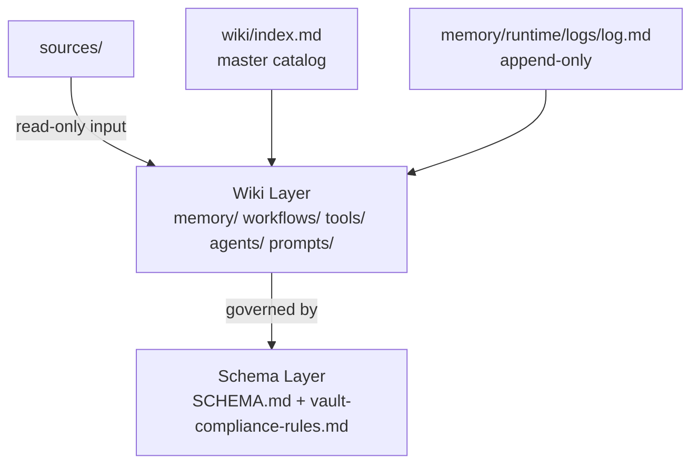
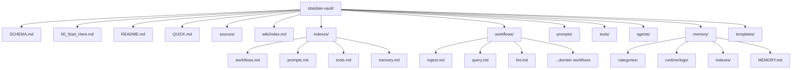
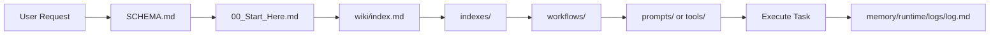
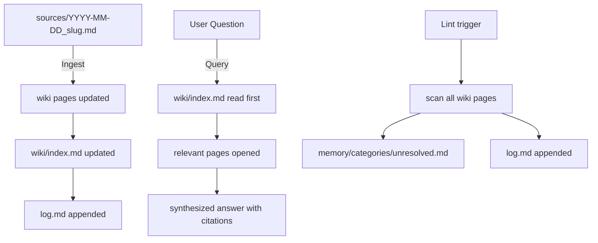
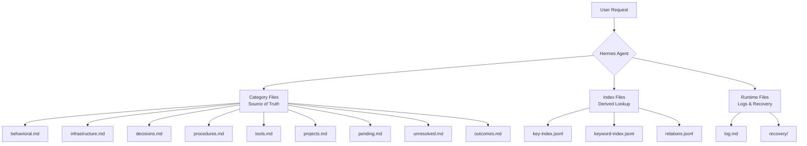
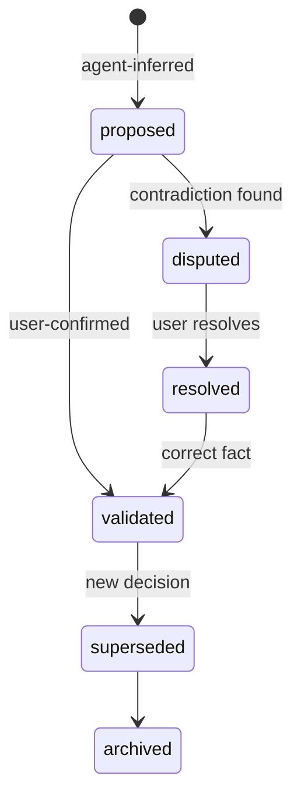
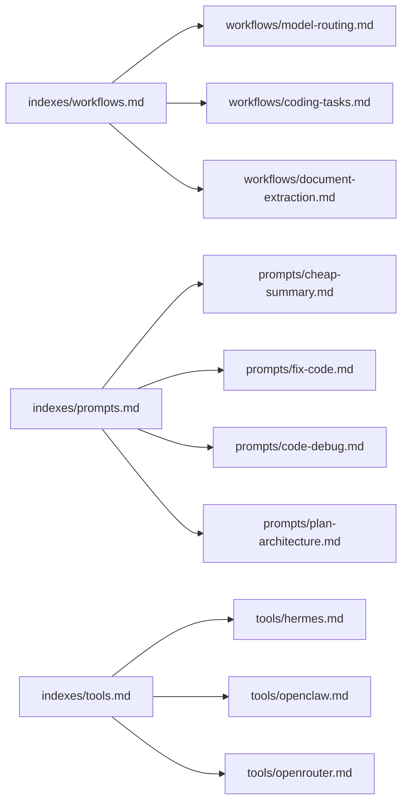

# Vault Architecture

Visual overview of the AI Agent Wiki structure and navigation flows.

## Three-Layer Architecture (Karpathy LLM Wiki Pattern)

## Folder Structure

## Agent Navigation Flow

## Three Operations Flow

## Memory System Architecture

## Truth State Transitions

## File Type Legend

| Prefix | Type | Purpose |
|--------|------|---------|
| `00_` | Entry point | Agent/human starting point |
| `indexes/` | Cross-reference | Navigation tables |
| `workflows/` | Task guides | Step-by-step procedures |
| `prompts/` | Templates | Reusable prompt patterns |
| `tools/` | Reference | Tool capability cards |
| `agents/` | Profiles | Agent definitions |
| `memory/` | Knowledge | Governed truth store |
| `templates/` | Scaffolds | File creation templates |

## Navigation Quick Reference

| From | To | When |
|------|-----|------|
| 00_Start_Here.md | indexes/workflows.md | Need a task workflow |
| indexes/workflows.md | workflows/*.md | Select specific workflow |
| workflow | prompts/*.md | Get prompt template |
| Any | memory/*.md | Recall facts |
| Any | tools/*.md | Understand tool capabilities |
| Any | agents/*.md | Understand agent roles |

## Index Dependencies

## Related Documentation

- [[README]] — Full vault documentation
- [[QUICK]] — Quick reference guide
- [[00_Start_Here]] — Entry point
- [[memory/memory-rules]] — Memory governance rules
- [[archive/CHANGELOG]] — Vault version history