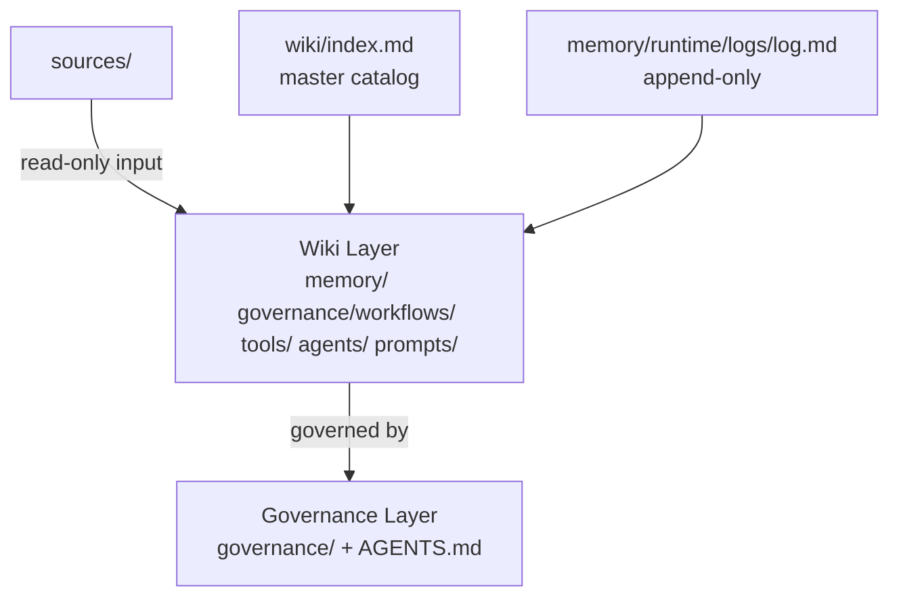
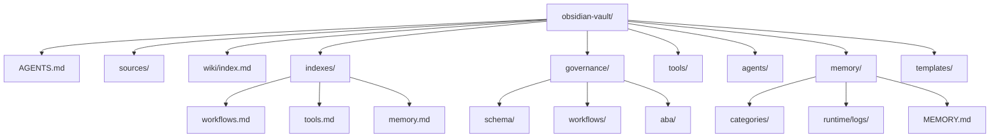
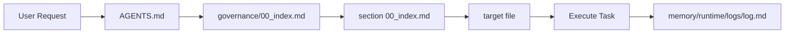
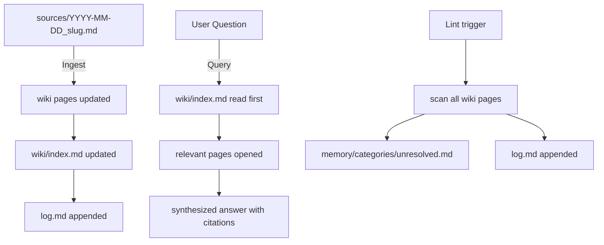
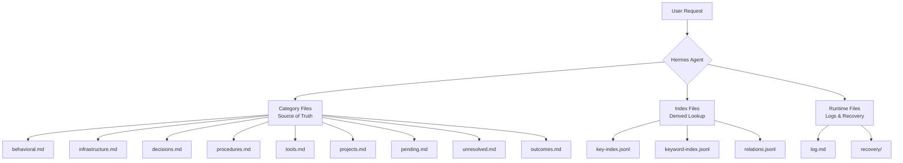
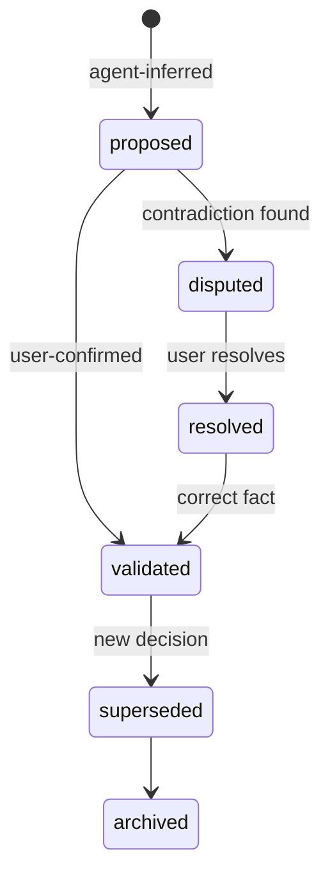
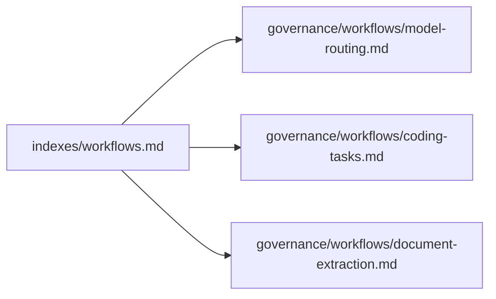

# Governance Model

*Part of the Knowledge Library Governance Framework v2.0. See [[governance/00_governance-index]] for all governance sub-documents.*

---

## Foundational Operating Principle

> **The LLM is the primary author and maintainer of synthesized knowledge. Humans set direction, approve changes, and review quality. The moment humans write wiki content directly at scale, the compounding mechanic breaks and you have a traditional KM system.**

This principle governs every role, policy, and workflow in this framework. Zone 2–3 content is **LLM-owned markdown**. Humans are product owners, not editors.[cite:28][cite:32]

---

## Governance Model: Federated + LLM-Native

The library adopts a **federated LLM-native governance model**[cite:24]:

- Central authority (Library Steward) sets universal standards — schema, lint rules, agent navigation, promotion protocols — and these are non-negotiable
- Domain Stewards manage sector content accuracy within centrally defined structure
- LLM agents own all writing, index maintenance, linting, and synthesis
- Humans approve, direct, and review — they do not draft

A purely centralized model creates bottlenecks. A fully decentralized model causes schema drift and inconsistency. The federated model protects the two most critical assets: **index reliability** and **schema discipline** — while allowing domain experts to manage knowledge without central approval for every edit.[cite:24]

---

## Roles & Authority Map

| Role | Authority Level | Primary Accountabilities |
|---|---|---|
| **Library Steward** | Final approver | Schema integrity, promotion/demotion rules, agent contract (`AGENTS.md`), governance decisions |
| **Technical Maintainer** | Implements approved changes | Lint tooling, schema migrations, file structure, changelog entries, LLM tooling |
| **Domain Stewards** (per sector) | Approve sector content | Accuracy of shelter, WASH, DRR, protection, livelihoods, coordination, tenure content in Zones 2–3 |
| **Agent Maintainer** | Manages LLM behavior | `AGENTS.md`, agent prompts, retrieval rules, runtime contradiction logic, fallback ladder |
| **Evidence Reviewer** | Gates field findings | Validates field instrument findings before `11-patterns/` entry; enforces evidence criteria |
| **Knowledge Governance Council** | Strategic direction | Quarterly cross-cutting decisions, scope changes, promotion disputes, multi-sector contradictions |
| **LLM Agent** | Primary author | All wiki synthesis, index auto-maintenance, lint reports, output drafts, backlink management |

> **Hard rule:** No agent may silently rewrite schema or governance rules. Agents propose; humans approve.[cite:23]

---

## The Agent Contract: `AGENTS.md`

The single most important file in the library. **Every agent reads this first, every time.** It consolidates what was previously split across `schema/`, `00-overview/`, and `13-agent-prompts/` into one authoritative behavioral contract — consistent with Karpathy's `AGENTS.md` / `CLAUDE.md` single-schema principle.[cite:36][cite:28]

### 1. Library Structure Map

A concise description of all zones, folders, and their purpose — precise enough that an agent can navigate without reading the full library. Each zone entry includes: folder name, purpose, mutability class, and when an agent should or should not read it.

### 2. Mutability Rules

| Location | Mutable? | By Whom |
|---|---|---|
| `raw/` | Never | No one — input only |
| `governance/schema/` | Controlled | Technical Maintainer after Steward approval |
| `AGENTS.md` | Controlled | Agent Maintainer after Steward approval |
| `00-overview/` | Controlled | Library Steward |
| `01-05/` Zone 2 | LLM-drafted, human-approved | LLM drafts; Domain Steward approves |
| `06-10/` Zone 3 | LLM-drafted, human-approved | LLM drafts; Domain Steward approves |
| `11-patterns/` | Open intake, gated promotion | LLM logs; Evidence Reviewer gates promotion |
| `12-risks-contradictions/` | Open addition, governed removal | Any role adds; Steward approves removals |
| `outputs/` | Traceable | LLM drafts; content owner approves for release |

### 3. Runtime Contradiction Rule

Before answering any advisory or prescriptive query, the agent checks `12-risks-contradictions/00_index.md` for relevant `risk_tags`. If a contradiction exists, the agent discloses it and qualifies the recommendation — it does not suppress or work around it.[cite:23]

```
IF query is descriptive       → contradiction check: optional
IF query is advisory          → contradiction check: required
IF query is prescriptive      → contradiction check: mandatory
IF query is donor-facing      → contradiction check: mandatory + disclose if found
```

Relevant `risk_tags` include: `targeting`, `tenure`, `municipal_authority`, `informal_settlements`, `cash_assistance`, `relocation`, `WASH`, `DRR`, `protection`.

### 4. Fallback Ladder

The agent follows this ladder in strict order — no skipping.[cite:23]

```
1. Read relevant 00_index.md
2. Read the most likely file named in the index
3. Check neighboring zone index
4. Search metadata/tags across indexes only
5. Abstain or request clarification
6. [Only with explicit human permission] Broader source search
```

For high-risk outputs, the fallback is **abstain or escalate** — never broad-search. Broad-searching the whole library breaks the architecture's core discipline: agents answer from canonical knowledge, not raw accumulation.

### 5. Index Auto-Maintenance Rule

After every ingest or content update, the agent updates the relevant `00_index.md` automatically. Index entries are generated from file frontmatter. Humans lint-check indexes periodically; they do not write them manually.[cite:28]

Every compliant index entry answers six questions:
1. What is this file?
2. When should an agent read it?
3. When should an agent *not* read it?
4. What source or framework does it depend on?
5. What risks or contradictions are linked to it?
6. What outputs use it?

### 6. Standard Agent Workflows

The agent contract defines five named, callable workflows:

| Workflow | Trigger | Output |
|---|---|---|
| `INGEST` | New source added to `raw/` | Compiled wiki entry, updated `00_index.md`, backlinks added |
| `QUERY` | Human or agent question | Answer with contradiction checks and fallback ladder applied |
| `LINT` | Scheduled or on-demand | `lint-report-YYYY-MM-DD.md` filed to `outputs/internal/` |
| `PROMOTE` | Pattern reaches promotion threshold | Drafted concept/framework/tool update with evidence block |
| `OUTPUT` | Request for external artifact | Drafted output with full provenance block |

---

## Three-Layer Architecture

| Layer | Location | Rule |
|-------|----------|------|
| **Sources** | `sources/`, `wiki/aba/raw/` | Raw documents. Read only. Never edit. |
| **Wiki** | `memory/`, `governance/workflows/`, `tools/`, `agents/`, `prompts/`, `wiki/aba/` | LLM-maintained knowledge pages. ABA wiki has its own schema and operating rules. |
| **Governance** | `governance/`, `AGENTS.md` | Conventions, structure definitions, and behavioral contracts. |

---

## Special Files

| File | Purpose | Rule |
|------|---------|------|
| `wiki/index.md` | Master catalog of all wiki pages | Read first on every query. Update after every ingest. |
| `memory/runtime/logs/log.md` | Append-only operation timeline | Append after every ingest, query that produces new knowledge, and lint. |
| `AGENTS.md` | Agent entry point and routing table | Start here when navigating the vault. |
| `governance/00_index.md` | Governance section index | Read before any governance or schema operation. |

---

## Architecture Diagrams

### Three-Layer Architecture (Karpathy LLM Wiki Pattern)



### Folder Structure



### Agent Navigation Flow



### Three Operations Flow



### Memory System Architecture



### Truth State Transitions



### Index Dependencies



---

## What v2 Closes

v1 showed **information flow** clearly. v2 adds the missing layers:

| Layer | v1 Status | v2 Status |
|---|---|---|
| Authority flow | Implicit | Explicit — roles, authority levels, change protocols |
| LLM-native authorship | Assumed | Stated as foundational operating principle |
| Agent contract | Fragmented across 3 folders | Consolidated in single `AGENTS.md` |
| Compounding mechanic | Shown in diagram | Governed — internal outputs always file back in |
| Proactive linting | Static contradiction register | LLM-run health checks with failure levels |
| Trigger layer | Absent | Automated lint runs, review date alerts, pattern queue aging |
| Output classes | Single class | External (full provenance) vs. internal (lightweight filing) |

The structure was already strong. v2 makes the **discipline behind the structure** as explicit as the structure itself. Without this layer, the architecture is a well-designed system maintained by hope. With it, it becomes a durable, agent-native knowledge system capable of scaling to 10x content volume without structural failure.[cite:28][cite:24]

---

*Document version: 2.0 | Prepared: May 2026 | Review cycle: Annual or upon major schema change*
