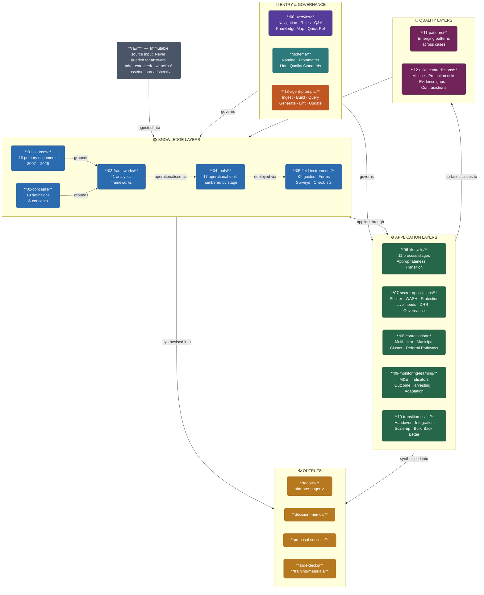
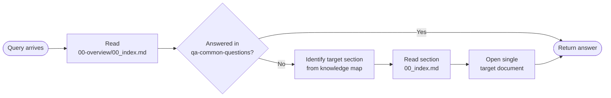

# ABA Knowledge Library — Architecture

```mermaid
flowchart TD
    classDef entry fill:#553C9A,color:#fff,stroke:#44337A,rx:6
    classDef schema fill:#2C7A7B,color:#fff,stroke:#285E61,rx:6
    classDef agent fill:#C05621,color:#fff,stroke:#9C4221,rx:6
    classDef knowledge fill:#2B6CB0,color:#fff,stroke:#2C5282,rx:6
    classDef application fill:#276749,color:#fff,stroke:#22543D,rx:6
    classDef quality fill:#702459,color:#fff,stroke:#521B41,rx:6
    classDef output fill:#B7791F,color:#fff,stroke:#975A16,rx:6
    classDef raw fill:#4A5568,color:#fff,stroke:#2D3748,rx:6

    %% ── ENTRY & GOVERNANCE ──────────────────────────────────────────
    subgraph ENTRY["  ⬡  ENTRY & GOVERNANCE  "]
        direction LR
        OV["**00-overview**\nNavigation · Rules · Q&A\nKnowledge Map · Quick Ref"]:::entry
        SC["**schema/**\nNaming · Frontmatter\nLint · Quality Standards"]:::schema
        AP["**13-agent-prompts/**\nIngest · Build · Query\nGenerate · Lint · Update"]:::agent
    end

    %% ── KNOWLEDGE LAYERS ────────────────────────────────────────────
    subgraph KNOWLEDGE["  📚  KNOWLEDGE LAYERS  "]
        direction LR
        K1["**01-sources/**\n16 primary documents\n2007 – 2026"]:::knowledge
        K2["**02-concepts/**\n19 definitions\n& concepts"]:::knowledge
        K3["**03-frameworks/**\n41 analytical\nframeworks"]:::knowledge
        K4["**04-tools/**\n17 operational tools\nnumbered by stage"]:::knowledge
        K5["**05-field-instruments/**\nKII guides · Forms\nSurveys · Checklists"]:::knowledge
    end

    %% ── APPLICATION LAYERS ──────────────────────────────────────────
    subgraph APPLICATION["  ⚙️  APPLICATION LAYERS  "]
        direction LR
        A1["**06-lifecycle/**\n11 process stages\nAppropriateness → Transition"]:::application
        A2["**07-sector-applications/**\nShelter · WASH · Protection\nLivelihoods · DRR · Governance"]:::application
        A3["**08-coordination/**\nMulti-actor · Municipal\nCluster · Referral Pathways"]:::application
        A4["**09-monitoring-learning/**\nM&E · Indicators\nOutcome Harvesting · Adaptation"]:::application
        A5["**10-transition-scale/**\nHandover · Integration\nScale-up · Build Back Better"]:::application
    end

    %% ── QUALITY LAYERS ──────────────────────────────────────────────
    subgraph QUALITY["  🔎  QUALITY LAYERS  "]
        direction LR
        Q1["**11-patterns/**\nEmerging patterns\nacross cases"]:::quality
        Q2["**12-risks-contradictions/**\nMisuse · Protection risks\nEvidence gaps · Contradictions"]:::quality
    end

    %% ── OUTPUTS ─────────────────────────────────────────────────────
    subgraph OUTPUTS["  📤  OUTPUTS  "]
        direction LR
        O1["**toolkits/**\naba-one-pager ✓"]:::output
        O2["**decision-memos/**"]:::output
        O3["**proposal-sections/**"]:::output
        O4["**slide-decks/**\n**training-materials/**"]:::output
    end

    %% ── RAW ─────────────────────────────────────────────────────────
    RAW["**raw/**  —  Immutable source input. Never queried for answers.\npdf/ · extracted/ · webclips/ · assets/ · spreadsheets/"]:::raw

    %% ── RELATIONSHIPS ───────────────────────────────────────────────
    RAW -->|"ingested into"| KNOWLEDGE
    ENTRY -->|"governs"| KNOWLEDGE
    ENTRY -->|"governs"| APPLICATION
    K1 & K2 -->|"grounds"| K3
    K3 -->|"operationalised as"| K4
    K4 -->|"deployed via"| K5
    KNOWLEDGE -->|"applied through"| APPLICATION
    APPLICATION -->|"surfaces issues to"| QUALITY
    QUALITY -->|"feeds back into"| KNOWLEDGE
    KNOWLEDGE -->|"synthesised into"| OUTPUTS
    APPLICATION -->|"synthesised into"| OUTPUTS
```

## Agent Navigation Flow

```mermaid
flowchart LR
    Q(["Query arrives"]) --> IDX["Read\n00-overview/00_index.md"]
    IDX --> QA{"Answered in\nqa-common-questions?"}
    QA -->|"Yes"| ANS(["Return answer"])
    QA -->|"No"| SEC["Identify target section\nfrom knowledge map"]
    SEC --> SIDX["Read section\n00_index.md"]
    SIDX --> DOC["Open single\ntarget document"]
    DOC --> ANS
```
